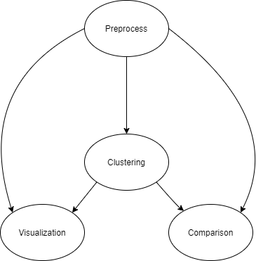

# scRNAClust

## This repository belongs to the RNA Sequence Pipeline for DR.Camila de Souza's Laboratory 

## This pipeline follows the following sequential structure 

## Installation

Please download and run on **Python version 3.9.7** and **R version 4.0.0**
To make use of this pipeline and its functionalities please install the latest version of [Anaconda](https://www.anaconda.com/)

Set up Anaconda Enviroment 

`conda install -c conda-forge mamba`

`mamba create -c conda-forge -c bioconda -n rnaPipeline snakemake --file requirements.txt `

`conda activate rnaPipeline`

Install Backspin 

`conda install -c bioconda backspinpy`

Install [Giniclust](https://github.com/lanjiangboston/GiniClust) and edit the path in /rnaPipe/giniclust.R to the corresponding Giniclust directory 

Install rnaPipe package and its dependencies 

`CMD R build rnaPipeline`

`CMD INSTALL rnaPipeline`

## Execution 

run `cd Snakemake/<PROCESS TO RUN>`

Then execute the desired process with 

`snakemake --configfile config.yaml -c1 `

## Tests
Test for this software will be done with the LaManno data set. 

LaManno is a lightweight single cell RNA sequencing data set, making it convenient for testing. 

Please follow the instructions in the execution with the `PATH TO RAW DATA` portion in the config file set to `./test/LaManno` 

## Outputs

All outputs are generated to the /output directory

Updating any output or software path can be done within the config.yaml files for each procedure

## Example of analysis produced 

